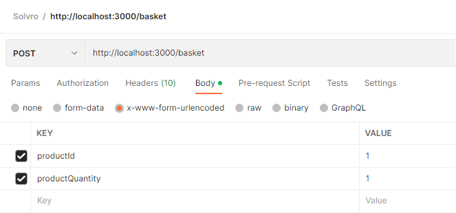
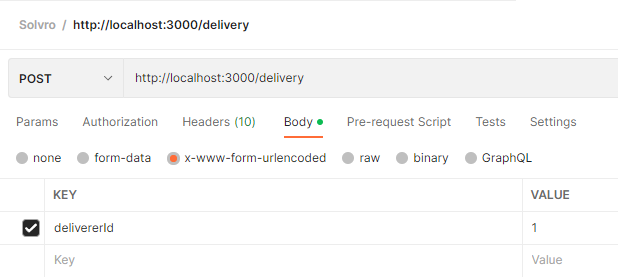
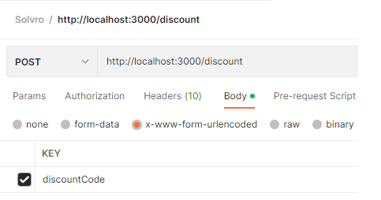
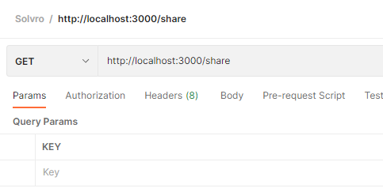

# Solvro
Zadanie projektowe wykonane w ramach rekrutacji do Koła naukowego Solvro.

## Treść zadania
>Zaprojektuj i napisz kod API koszyka internetowego.
>
>Aplikacje możesz stworzyć w JavaScriptcie, TypeScriptcie, Pythonie lub Go. Możesz użyć dowolnych frameworków czy bibliotek. 
>
>## Oczekiwane funkcjonalności:
>1. Dodawanie przedmiotu do koszyka
>2. Usuwanie przedmiotu z koszyka
>3. Zmiana ilości przedmiotu
>4. Dodawanie kodu rabatowego (procentowy oraz stała kwota)
>5. Zmiana typu dostawy (różne ceny za dostawę)
>6. Wyświetlanie informacji o koszyku (Sumaryczna cena przedmiotów, zastosowany rabat, końcowa cena koszyka).
>7. Dzielenie się koszykiem (możliwość wysłania go do innego użytkownika, po otworzeniu linku produkty powinny zostać umieszczone w nowym koszyku nowego użytkownika).
>8. Pamiętaj że koszyk powinien być umieszczony w kontekście sesji pojedynczego użytkownika, nie może być globalny.
>
>
>### Nice to have:
>- Secure API wraz z wytycznymi: https://cheatsheetseries.owasp.org/cheatsheets/REST_Security_Cheat_Sheet.html
>- Testy jednostkowe
>- Użycie GraphQL

Źródło: [Solvro/Rekrutacja2022](https://github.com/Solvro/Rekrutacja2022/blob/master/backend/zadanie.md#oczekiwane-funkcjonalno%C5%9Bci)

## Instalacja
```
  git clone https://github.com/MATIK0582/Solvro.git
  cd Solvro
  npm install
```

## Baza danych
Projekt jako bazy danych używa `Postgresql` w wersji: 15. <br>
Do poprawnego funkcjonowania aplikacji potrzebne jest stworzenie tabeli `Solvro`.
```
  CREATE DATABASE Solvro;
```
Dodatkowo w pliku `.env` trzeba podmienić hasło na to ustawione podczas instalacji.
```
  DATABASE_PASSWORD = "twoje_hasło"
```
Program zakłada domyślną nazwę użytkownika - `postgres`. Jeżeli podczas konfiguracji bazy danych ustawiłeś inną nazwę musisz ją zmienić w pliku [/config/database.js](./config/database.js).
```
  const config = new Sequelize('Solvro', 'postgres', process.env.DATABASE_PASSWORD, {
```

## Endpointy
```
GET     /basket
POST    /basket
PUT     /basket
DELETE  /basket
POST    /discount
DELETE  /discount
POST    /delivery
DELETE  /delivery
GET     /share
POST    /share
```

## Uruchamianie
-`npm start` Uruchomienie aplikacji <br>
-`npm run dev` Uruchomienie nodemon'a

## Użytkowanie
Z użyciem narzędzia typu Postman lub Swagger wysyłamy pakiety na wystawione przez aplikacje endpoint'y. <br>
W zależności od wybranej akcji dany pakiet będzie potrzebował odpowiednio dodatkowych parametrów.

- Basket <br>


- Delivery <br>


- Discount <br>


- Share <br>


#### Przyjemnego sprawdzania ;)


